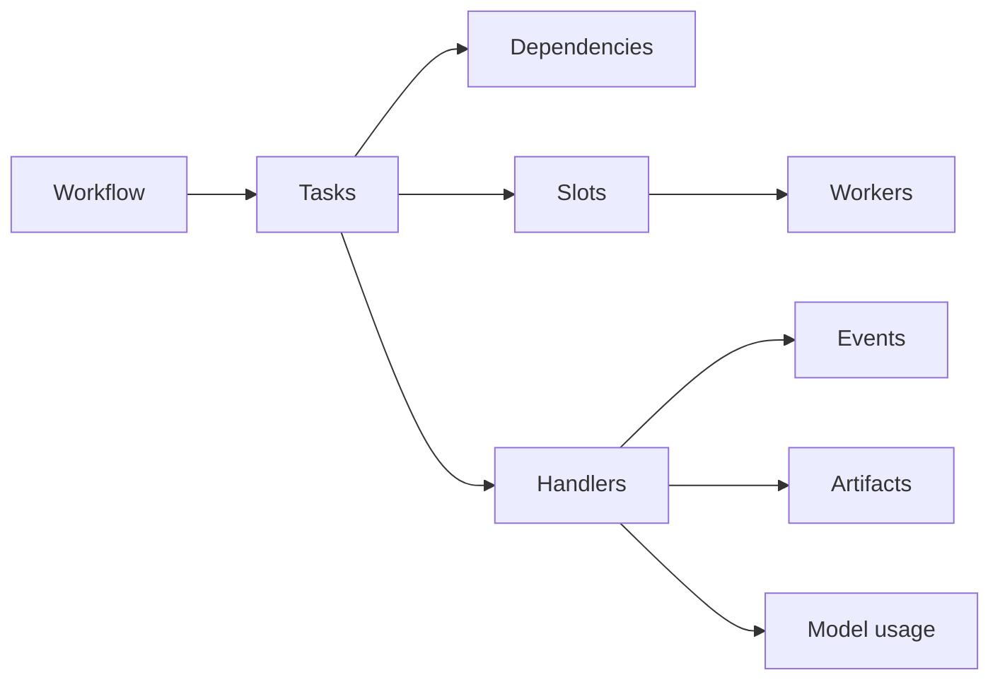

# pgloom

[](https://pypi.org/project/pgloom/)
[](https://pypi.org/project/pgloom/)
[](LICENSE)
[](https://github.com/joshorig/pgloom/actions/workflows/ci.yml)

`pgloom` is a Postgres-backed workflow and task orchestration runtime for
building domain-specific automation systems. It provides durable workflow state,
task dependencies, worker leases, slots, approvals, idempotency records, model
usage accounting, artifacts, notifications, health checks, and a scenario
harness.

## Quickstart

```bash
pip install pgloom
createdb pgloom_dev
export PGLOOM_DATABASE_URL=postgresql://localhost/pgloom_dev
pgloom db migrate
pgloom workflow create --domain demo --name smoke
pgloom task enqueue --workflow-id <workflow_id> --slot fake --task-type fake.complete
pgloom worker run-once --slot fake
```

For local development:

```bash
scripts/bootstrap_dev_env.sh
source .venv/bin/activate
just test
```

## Concepts



- **Workflows** group related tasks and carry domain metadata.
- **Tasks** are durable units of work with state, attempts, payloads, results,
  blockers, dependencies, and leases.
- **Slots** model constrained execution capacity such as `claude`, `codex`, or
  `qa`.
- **Handlers** are application code that claims tasks and returns structured
  outcomes.

## Embedding

Domain orchestrators import `pgloom` and keep their own domain behavior outside
the core runtime. `engineering-orchestrator` is the reference consumer planned
for engineering-specific planner, implementer, reviewer, QA, historian, GitHub,
BRAID, worktree, and Telegram behavior.

## Documentation

- [Architecture](docs/architecture.md)
- [Postgres schema](docs/postgres-schema.md)
- [Scenario harness](docs/scenario-harness.md)
- [Release process](docs/release-process.md)
